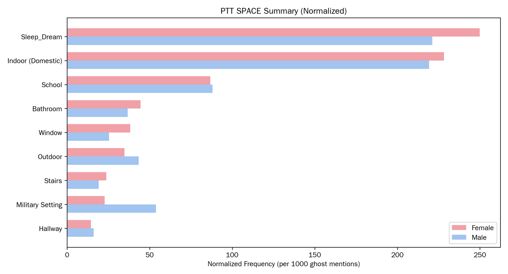
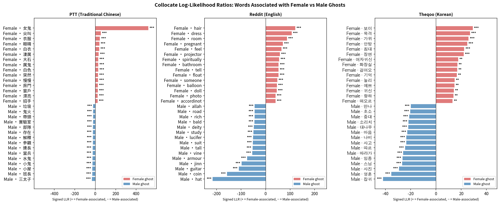
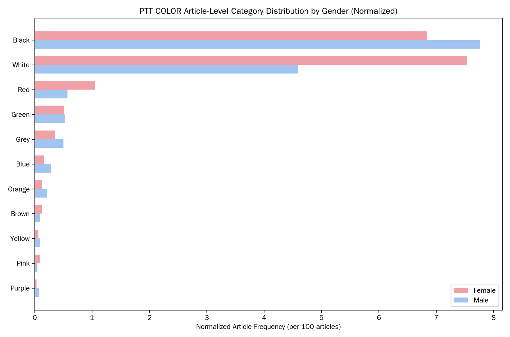

# Ghost Stories NLP: How Female and Male Ghosts Are Written Across Taiwan, Korea and the US

Master's thesis analysis code (KAIST Graduate School of Culture Technology, 2026). It studies ghost-experience posts from PTT (Taiwan), TheQoo (Korea) and Reddit (US), and asks how ghosts are gendered in each culture's online storytelling.

The thesis PDF and the raw posts are not published. This repository holds the analysis code only.


*Normalized frequency of spaces in ghost stories on PTT, by ghost gender. Female ghosts lean toward sleep, dreams, bathrooms and windows; the one clearly male space is the military.*

**In short**
- 3 platforms, 3 languages: female ghosts are tied to bodies, homes and the senses; male ghosts to institutions and religion.
- A rule-based + LLM cascade labels ghost gender at macro-F1 0.94 and beats the rules alone (McNemar exact test, p < .001).
- Platform differences are real but modest (Cramér's V about 0.10).

## Problem
Ghost stories are often told as personal experience, so they carry everyday ideas about who belongs where. I wanted to see whether the public/private split (women in domestic, bodily spaces; men in institutional ones) shows up in thousands of stories in three languages.

Three questions:
1. How common are female ghosts on each platform?
2. How do the stories differ by ghost gender (space, color, haunting method, vocabulary)?
3. Do these differences point to gender structures in each society?

## My role
I designed the research, wrote the classification and analysis pipeline, labeled the validation sample, and wrote the thesis. I used Claude Code and Claude as coding assistants and the Claude API as one stage of the classifier (see Process). Design choices, labels and interpretation are mine.

## Data
| Platform | Language | Posts |
|---|---|---|
| PTT | Traditional Chinese | 15,759 |
| TheQoo | Korean | 967 |
| Reddit | English | 5,667 |

Posts were collected from public boards. The raw data is not in this repository, because the posts belong to their authors and the platforms' terms apply. Put your own copy under `data/raw/` and update the paths at the top of each notebook.

## Tools
Python (pandas, scikit-learn, gensim, spaCy, jieba, KoNLPy/Kiwi, statsmodels, scipy), R (tidyverse, rmarkdown) for the statistics, the Anthropic API (Claude Haiku and Sonnet) for the fallback classifier.

## Process
1. Entity classification, a rule-based + LLM cascade. A conservative rule-based classifier assigns gender from kinship terms, pronouns and gendered ghost words. Mentions without enough cues go to Claude Haiku with a ±2-sentence context, and to Claude Sonnet if Haiku is unsure.
2. State classification. A hierarchical keyword search separates supernatural, deceased and living entities.
3. Validation. A stratified human-labeled sample (precision, recall, F1, Cohen's kappa), McNemar's exact test between the rule-only and cascade versions, and an LLM-as-judge check.
4. Gender distribution. Chi-square or Fisher tests with Cramér's V, at mention and article level.
5. Lexical association. Dunning's log-likelihood ratio on content words around female and male ghosts, with Benjamini-Hochberg correction.
6. Themes. Space, color and haunting method, checked against LDA topic models. Word2Vec neighborhoods of the key words, compared across platforms with Kruskal-Wallis and Wilcoxon tests.

| Notebook | Content |
|---|---|
| `notebooks/01_haunted_space_gender_distribution.ipynb` | Space, color and haunting-method distributions by gender |
| `notebooks/02_gender_ghost_analysis.ipynb` | Cascade classifier, validation, gender distribution |
| `notebooks/03_topic_modeling.ipynb` | LDA on the three corpora |
| `notebooks/04_word2vec_LLR_thematic.ipynb` | LLR collocates and Word2Vec neighborhoods |
| `notebooks/05_statistical_analysis.Rmd` | Statistical tests and tables |

## Key insights
- Platforms differ, but modestly. Female ghosts outnumber male on Reddit (46.5% vs 43.7%) and TheQoo (33.4% vs 16.1%); male ghosts lead on PTT (51.7% vs 39.4%), where military stories are common. Cramér's V is about 0.10.
- Female ghost words cluster around the body, the home and the senses (hair, dress, bathroom, bedroom, white clothes, screaming). Male ghost words cluster around institutions and religion (squad leader, military service, monk). All top collocates are significant after FDR correction.
- White is linked to female ghosts on PTT (OR 1.69) and Reddit (OR 1.28). Black shows no gender difference.
- Sound is the haunting method most tied to female ghosts (PTT OR 1.16, Reddit OR 1.24). Visual appearance and movement show no gender difference.
- TheQoo has few posts and 50.5% unknown-gender mentions, so its results are the least certain.





## Business impact
This is academic research with no deployment, so there is no business result. The reusable part is the method: a cheap rule layer that handles clear cases, an LLM only for ambiguous ones, and a validation step that checks the combination. The cascade reached gender macro-F1 0.94 (kappa 0.93) and beat the rule-only version on McNemar's exact test (b = 36, c = 6, p < .001).

## Challenges and learnings
- State classification is weaker (macro-F1 0.65, kappa 0.54). Whether a ghost is "deceased" or "supernatural" is often unclear in the text, and the LLM judge agreed with me less on it (kappa 0.33).
- Gendered words can make the analysis circular, so kinship terms and pronouns are removed from the LLR vocabulary.
- Three languages need three tokenizers, and each choice shifts the counts. I aligned them and documented the choices.
- Statistical significance and effect size told different stories (large samples, V near 0.10), so I describe the differences as real but small.

## Run it
```bash
pip install -r requirements.txt
cp .env.example .env          # add your own Anthropic key; never commit .env
export ANTHROPIC_API_KEY=...  # or load it from .env
jupyter lab notebooks/
```
Without a key, the rule-based layer still runs and the LLM fallback is skipped.

## License
MIT. See `LICENSE`.
